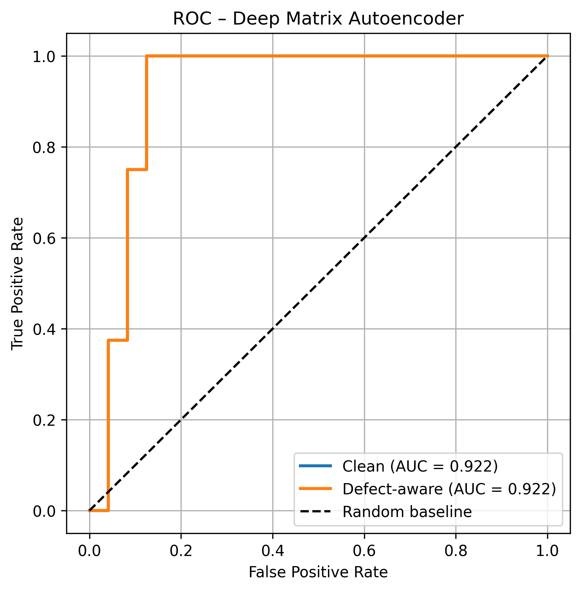

# Wi-Fi Based Cancer Diagnostics Using Machine Learning

**Bachelor's thesis project — Sapienza Università di Roma, 2024–2025**  
Faculty of Information Engineering, Computer Science and Statistics  
Supervisor: Prof. Luigi Cinque

---

## Overview

This project investigates whether commodity **Wi-Fi Channel State Information (CSI)** can detect the presence of hand tumors non-invasively. CSI amplitude matrices were collected at Policlinico Tor Vergata (Rome) from healthy participants and a patient with a diagnosed hand tumor. Several anomaly-detection models were trained exclusively on healthy CSI data and evaluated on their ability to flag tumor-affected hands as statistical outliers.

The best-performing model — a **Deep Matrix Autoencoder** — achieved AUC up to **0.92** on clean data and remained robust under synthetic hardware-fault conditions (defect-aware inputs).

---

## Key Results

| Model | Clean AUC | Defect-aware AUC |
|---|---|---|
| Deep Matrix Autoencoder | **0.84 – 0.92** | **0.83 – 0.89** |
| One-Class SVM | 0.779 | 0.776 |
| Isolation Forest | 0.646 | 0.646 |
| Shallow Autoencoder | 0.625 | 0.630 |

ROC curves for all models are in [`results/`](results/).



---

## Dataset

CSI data was collected at Policlinico Tor Vergata using a Wi-Fi transmitter–receiver pair placed on opposite sides of each participant's hand. Each acquisition captures **1501 packets × 52 subcarriers** of CSI amplitude.

| File | Description |
|---|---|
| `data/X_clean.npy` | Sanitized CSI matrices, shape `(56, 1501, 52)` |
| `data/X_defect.npy` | Defect-aware version with reintroduced packet-loss masks |
| `data/y.npy` | Labels: `0` = healthy, `1` = tumor (56 total, 48 healthy / 8 tumor) |

Data is stored via **Git LFS**.

---

## Preprocessing Pipeline

```
Raw CSI acquisition
      ↓
Interpolation & alignment  →  fixed shape (1501 × 52)
      ↓
IQR-based amplitude sanitization  →  outlier removal per packet
      ↓
Per-sample min-max normalization  →  values in [0, 1]
      ↓
(Optional) defect mask application
      ↓
Cleaned CSI matrix ready for models
```

See [`src/preprocessing.py`](src/preprocessing.py) for full implementation.

---

## Models

All models follow a **one-class learning** paradigm: trained only on healthy samples, tested on both healthy and tumor samples. Anomaly score = reconstruction error (autoencoders) or distance from learned boundary (SVM / Isolation Forest).

| File | Contents |
|---|---|
| [`src/models.py`](src/models.py) | All model architectures |
| [`src/preprocessing.py`](src/preprocessing.py) | Full preprocessing pipeline |
| [`src/evaluate.py`](src/evaluate.py) | ROC/AUC computation and plotting |
| [`src/train.py`](src/train.py) | CLI training script |

---

## Quickstart

### 1. Clone and install

```bash
git clone https://github.com/mariamlats/WiFi-Based-Cancer-Diagnostics.git
cd WiFi-Based-Cancer-Diagnostics
pip install -r requirements.txt
```

### 2. Train all models

```bash
python src/train.py --data_dir data/ --results_dir results/ --model all
```

### 3. Train a specific model

```bash
python src/train.py --model deep_ae
python src/train.py --model svm
```

---

## Repository Structure

```
WiFi-Based-Cancer-Diagnostics/
├── data/
│   ├── X_clean.npy          # sanitized CSI matrices (Git LFS)
│   ├── X_defect.npy         # defect-aware version  (Git LFS)
│   └── y.npy                # labels                (Git LFS)
├── results/
│   ├── roc_deep_ae.png
│   ├── roc_deep_ae_both.png
│   ├── roc_isolation_forest.png
│   ├── roc_shallow_ae.png
│   └── roc_svm.png
├── src/
│   ├── preprocessing.py
│   ├── models.py
│   ├── evaluate.py
│   └── train.py
├── requirements.txt
└── README.md
```

---

## Technical Stack

- **Python 3.10+**
- **TensorFlow / Keras** — deep autoencoder architectures
- **scikit-learn** — One-Class SVM, Isolation Forest
- **NumPy / SciPy** — signal processing and feature extraction
- **Matplotlib** — ROC curve visualization

---

## Citation

If you use this dataset or code, please cite:

```
Latsabidze, M. (2025). WiFi-Based Cancer Diagnostics Using Machine Learning.
Bachelor's Thesis, Sapienza Università di Roma.
Supervisor: Prof. Luigi Cinque.
```

---

## License

MIT License — see [LICENSE](LICENSE) for details.
